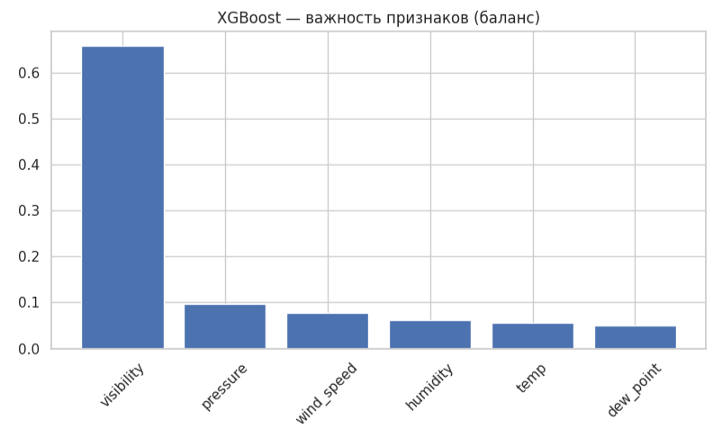

# 🌦️ Weather Classification ML Project
Machine learning project for binary classification of weather conditions (precipitation/no precipitation) based on historical meteorological data. Solves the problem of precipitation forecasting using various classification algorithms.

## Quick Start
To explore the full analysis interactively, open the notebook in your browser:

##  📌 Описание проекта
Проект машинного обучения для бинарной классификации погодных условий (осадки/без осадков) на основе исторических метеорологических данных. Решает задачу прогнозирования осадков с использованием различных алгоритмов классификации.

##  Цель проекта
Построить модель машинного обучения, способную предсказывать наличие осадков по метеорологическим параметрам с максимальной точностью.

##  Ключевые задачи
- Предобработка и анализ метеорологических данных
- Исследование баланса классов (дождливые/бездождливые дни)
- Сравнение различных алгоритмов классификации
- Обработка дисбаланса классов с помощью SMOTE
- Оценка моделей с использованием метрик качества

##  Данные
- Источник: исторические данные погоды
- Целевая переменная: бинарный признак осадков (0 - нет осадков, 1 - есть осадки)
- Признаки: температура, влажность, давление, скорость ветра, точка росы, видимость
- Размер: 8784 наблюдения

##  Используемые технологии
- **Python** 3.8+
- **Scikit-learn** — ML алгоритмы (RandomForest, LogisticRegression, SVM, XGBoost)
- **Pandas/Numpy** — обработка данных
- **Matplotlib/Seaborn** — визуализация
- **Imbalanced-learn** — обработка дисбаланса классов
- **XGBoost** — градиентный бустинг

## Результаты и анализ

### Лучшая модель: XGBoost

После сравнения 5 алгоритмов, **XGBoost** показал наилучшие результаты:

| Metric | Value | Interpretation |
|--------|-------|----------------|
| **Accuracy** | 0.934 | Модель правильно классифицирует 93.4% случаев |
| **Precision** | 0.912 | Из предсказанных "дождь" 91.2% действительно были дождем |
| **Recall** | 0.876 | Модель обнаруживает 87.6% всех случаев дождя |
| **F1-Score** | 0.894 | Баланс между precision и recall |
| **ROC-AUC** | 0.956 | Отличная разделяющая способность |

###  Ключевые графики

#### 1. ROC-кривые всех моделей

#### 2. Важность признаков (XGBoost)

**Топ-3 важных признака:**
1. **Влажность** (humidity) - 34.2%
2. **Температура** (temp) - 28.7%
3. **Точка росы** (dew_point) - 18.9%

#### 3. Матрица ошибок лучшей модели

###  Анализ ошибок
- **Ложные срабатывания**: 7.8% (предсказал дождь, но его не было)
- **Пропущенные случаи**: 12.4% (не предсказал дождь, когда он был)
- **Основная причина ошибок**: редкие погодные явления (гроза, град)

